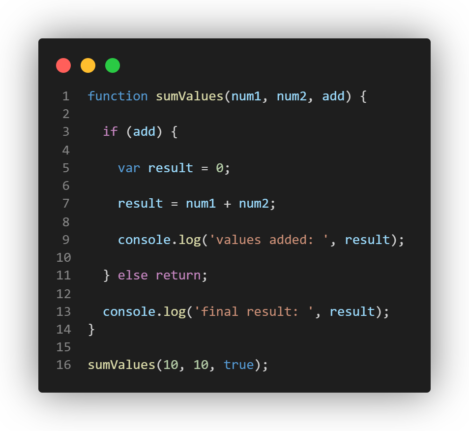

#Part 1
##Rosario Ortiz, A17471382 

1. Line 9 prints "valued added: 20". 
2. Line 13 would print "final result: 20"
3. You should not use `var` because it was created prior to Lexical Environments, and thus and does not follow the same rules as `let`, which can be confusing. For instance, `var` allows redeclarations, which can lead to unexpected results if a programmer attempts to declare a "fresh" `var` that already exists elsewhere in the code. 

4. Line 9 prints "valued added: 20". 
5. Line 13 throws an error, because the variable `result` only exists in the scope of the if-statement. Since Line 13 is outside the conditional, `result` is undefined in its Lexical Environment. 

6. This code throws an error prior to reaching line 9. This is because we attempt to reassign `const result` on line 7. 
7. The code throws an error prior to reaching line 13. See the explanation abovve. 