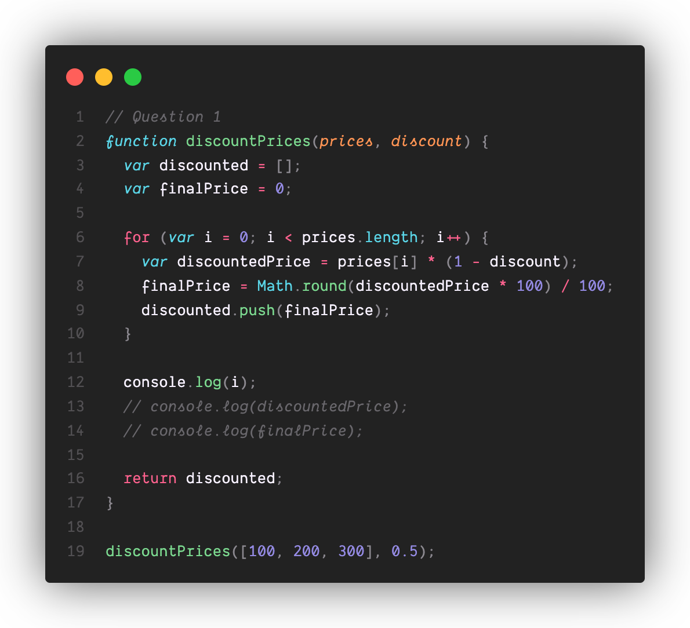
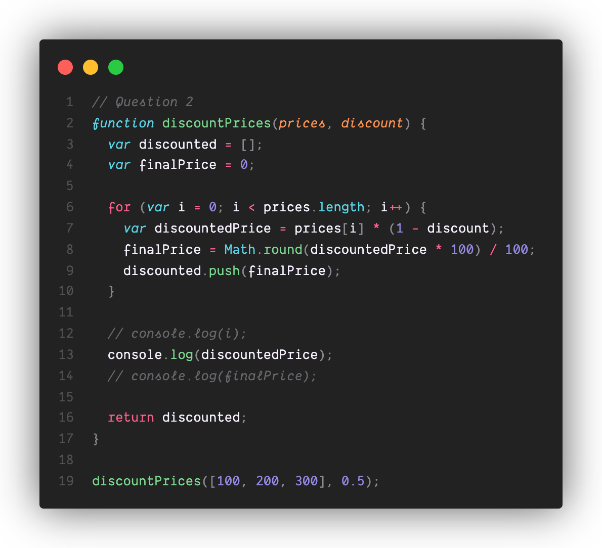
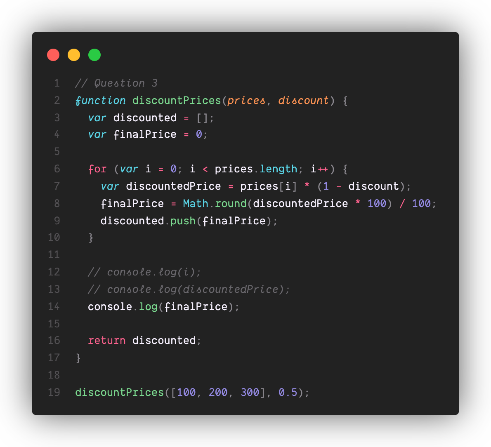
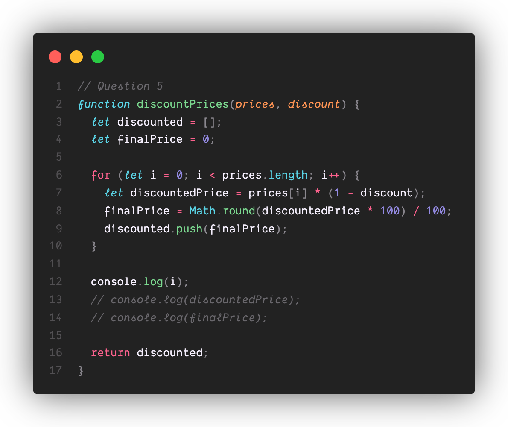
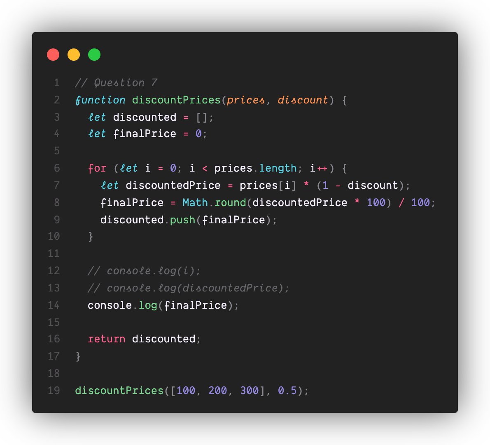
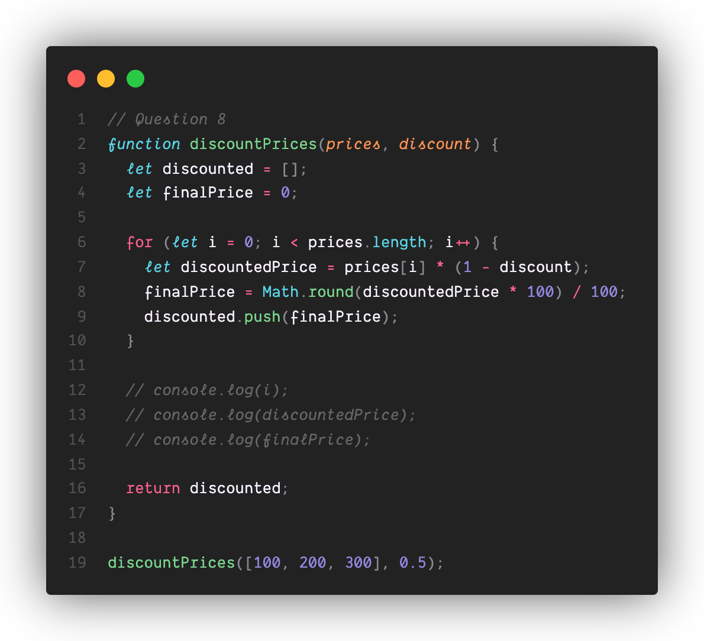
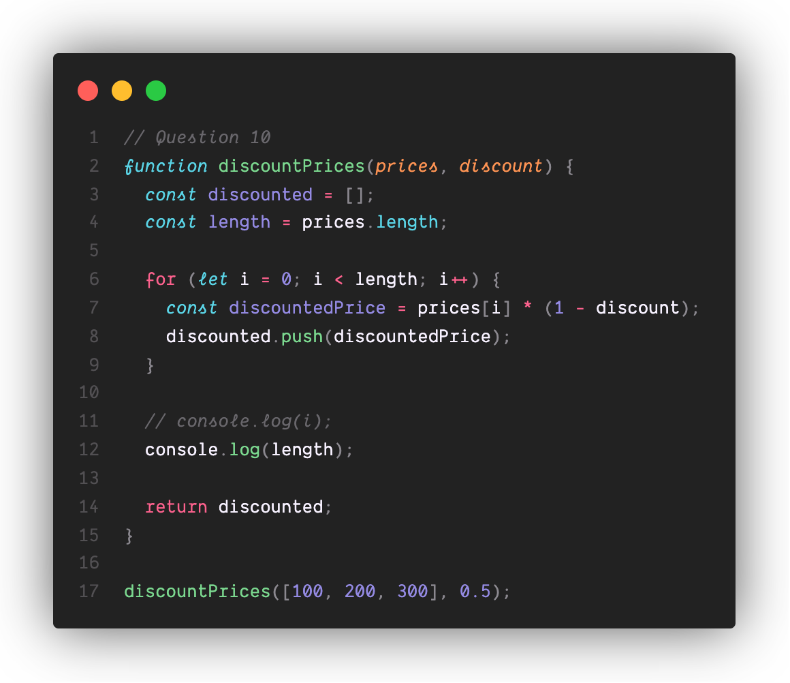
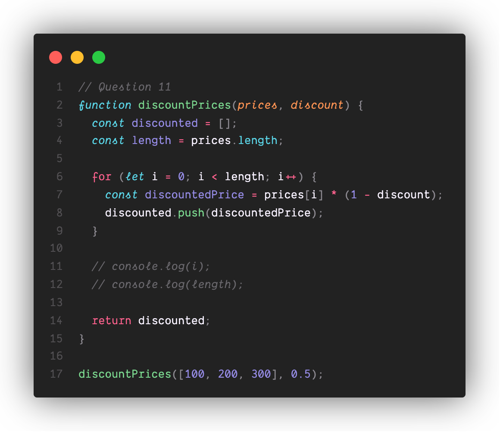
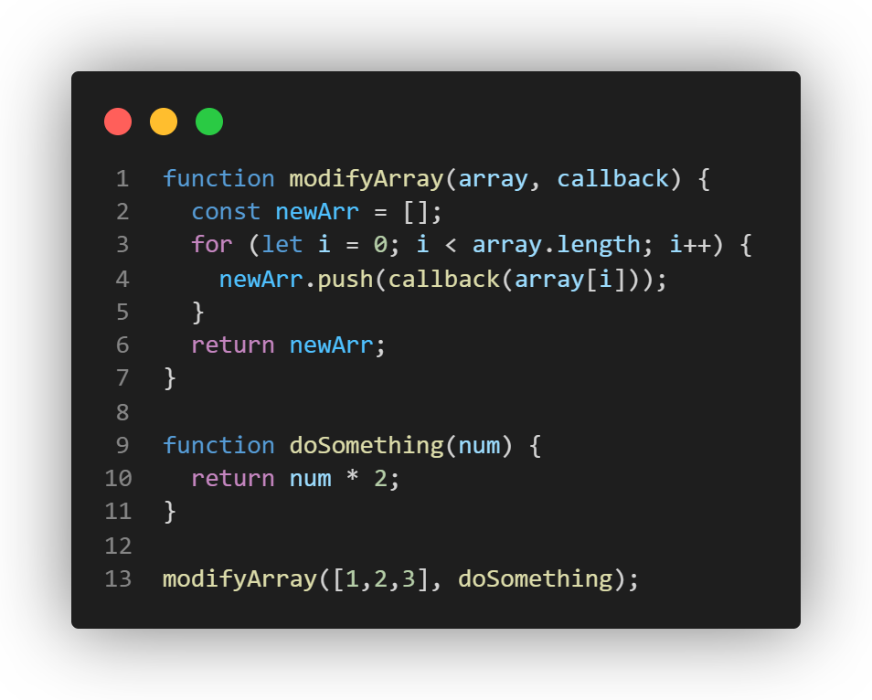
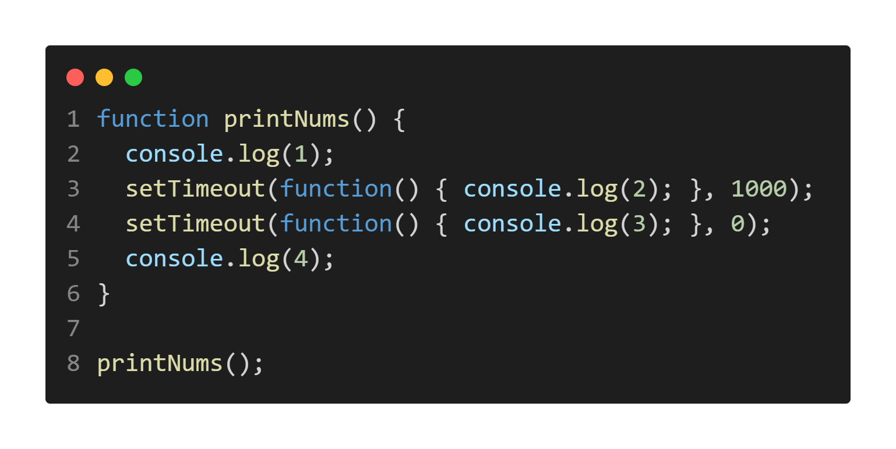

#Part 2
##Rosario Ortiz, A17471382 



1. At line 12, "3" will be printed to the console. Contrary to what we might expect, the iterator variable `i` is accessible outside the loop because `var` is not block scoped. Since the argument `prices` is a list of length 3 when we call `discountPrices()`, the loop runs until `i` is incremented to 3. 

    

2. At line 13, this function will print "150" to the console. Since `var`s tolerate redeclarations, `discountedPrice` simply takes on its most recently assigned value. The last iteration assigns`discountedPrice` the value `prices[2] * discount`, which equals 300 * 0.5, or 150. 
   
   
3. At line 14, "150" is printed. During the last iteration of the `for` loop, `finalPrice` is assigned the value `Math.round(discountedPrice * 100) /100`. We know `discountedPrice` is the integer "150", so these operations change nothing. 
   
4. This function returns `[50, 100, 150]`. The variable returned, `discounted` is declared as an empty list. In each iteration of the `for` loop, `price[i] * 0.5` is rounded and pushed to the end of the list, yielding this result.  
    
5. At line 12, an error will be thrown. The variable `i` is declared using the `let` keyword within a `for` loop. As such, `i` only exists within the scope of that loop. When we attempt to print it to console from outside the loop, its value is inaccessible. 
   
6. Prior to line 13, an error will be thrown. The variable `discountedPrice` is declared using the `let` keyword within a `for` loop. `let` variables cannot be redeclared, so the function will throw an error on the second loop iteration. 
   
7. Prior to line 14, an error will be thrown. The variable `discountedPrice` is declared using the `let` keyword within a `for` loop. `let` variables cannot be redeclared, so the function will throw an error on the second loop iteration.
   
8. This function will throw an error. The variable `discountedPrice` is declared using the `let` keyword within a `for` loop. `let` variables cannot be redeclared, so the function will throw an error on the second loop iteration.
   
9. At line 11, an error will be thrown. The variable `i` is declared using the `let` keyword within a `for` loop. As such, `i` only exists within the scope of that loop. When we attempt to print it to console from outside the loop, its value is inaccessible. 
    
10. At line 12, "3" will be printed to the console. This is because `length` is assigned to the value "3" as a constant variable in the function scope. As line 12 is in the function, `const length` will still be accessible. 
    
   

11. This function returns `[50, 100, 150]`. Although the variable `discounted`, is declared as a `const`, we are allowed to manipulate it as long as it is not reassigned. Since we push the discounted prices (half of the prices in the input list), within the for loop, this is what is returned. 


12. Given the above Object, write the notation for:  (These should be in your part2.md)
    - Accessing the value of the name property in the student object
      - `student.name`
    - Accessing the value of the Grad Year property in the student object
      - `student["Grad Year"]`
    - Calling the function for the greeting property in the student object.
      - `student.greeting()`
    - Accessing the name property of the object in the Favorite Teacher property in student
      - `student["Favorite Teacher"].name`
    - Access index zero in the array of the courseLoad property of the student object
      - `student.courseLoad[0]`

For each of the following questions, note down the output as well as a brief explanation why that output was given  (These should be in your part2.md)

13. Arithmetic
 - '3' + 2
   - `'32'` because the integer 2 is cast to a string in order to concatenate it with string `'3'`. 
- '3' - 2
  - `1` because the string 3 is cast to an integer in order to subtract integer 2 was not cast to a string as in the previous example because the `-` operator is undefined for strings. 
- 3 + null
  - `3` because `null` is cast to integer 0. 
- '3' + null
  - `'3null'` because `null` is cast to the string `'null'` in order to be concatenated with a string. 
- true + 3
  - 4 because `true` is cast to integer 1 in order for it to be added to an integer. 
- false + null
  - 0 because both values are cast to integer 0. This cast occurs for both values because it is the only mapping for which `+` is defined for these values. 
- '3' + undefined
  - '3undefined' because `undefined` is cast to its exact string representation to allow concatenation with another string. 
- '3' - undefined
  - `NaN`, because `undefined` is cast to `NaN` when we attempt to use it as a number. Since subtraction is not defined for string operands,  `'3'`  was cast to an integer, leading `undefined` to be interpreted as an integer. All math expressions including `NaN` evaluate to `NaN`, giving us this final result. 
  
14. Comparison
   - '2' > 1
     - `true`, because `'2'` is cast to integer 2 for which `>` is defined.
   - '2' < '12'
     - `false` because the `<` operator compares strings based on the lexographic order of each of their characters. Since the first character of `'12'`, `'1'` comes before `2` lexographically, `12` is interpreted to be less than '2'. 
   - 2 == '2'
     - `true`, because these operands are castable to one another. 
   - 2 === '2'
     - `false` because these operands have different types, despite being castable to one another. 
   - true == 2
     - 'false' because 'true' casts to the integer 1, which does not equal 2. 
   - true === Boolean(2)
     - 'true', because when nonzero integers are explicitly cast to booleans, they evaluate to true. 
  
15. Explain the difference between the == and === operators.
    - The `===` imposes stricter equality requirements than `==`. The former only returns `true` when both operands are equal values of the same type. By contrast, `==` will attempt to cast operands to the same type before evaluating their equality. 
16. The code that iterates through the given `statistics` object and prints values of properites starting with "r" and odd values can be found in [part2-question16.js](part2-question16.js)
17. The result of running the code below will be `[2, 4, 6]`. This is because the `modifyArray` function iterates through its parameter `array` and creates a new list of the results of calling the function `callback` on each element. Since `doSomething` is passed in as the `callback`, the new list doubles each element of the previous one. 
    
  18. The code that prints the current time every second can be found in [part2-question18.js](part2-question18.js)
        
  19. The above code outputs: 
         ```
            1
            4
            3
            2

         ```

         